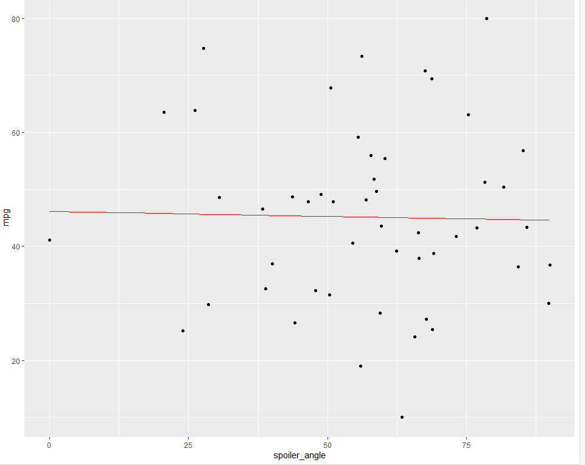
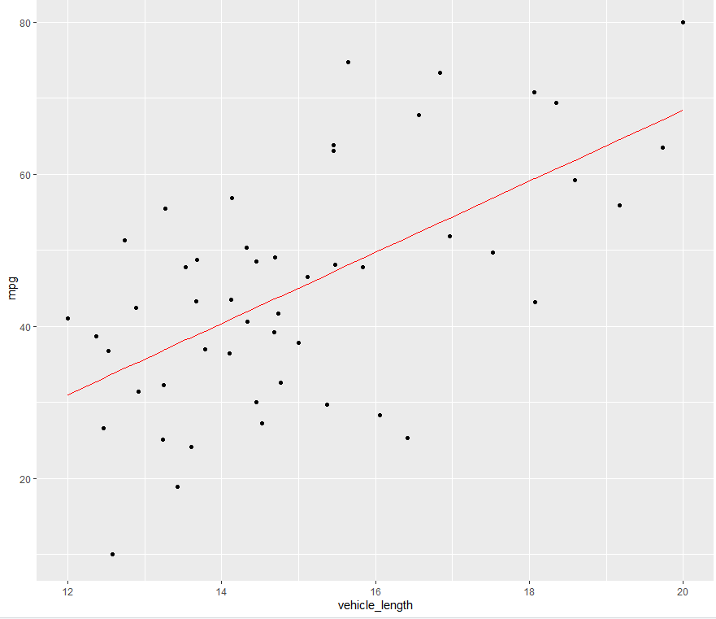
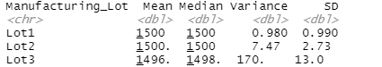
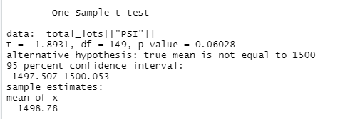
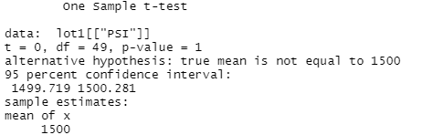
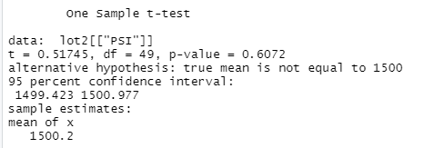
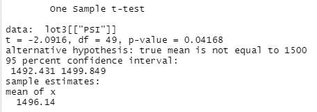

# M-Car_Statistical_Analysis

## Linear Regression to Predict MPG

Assuming that we have a significance level of 0.05 and a confidence Interval of 0.95, we find that the three variables vehicle_weight, spoiler_angle, and AWD have substantially larger p-values than our significance level. Vehicle length and ground clearance have very small p-values and provide non-random variance to our dependant variable mpg. Any particular slope in this multiple linear regression would not be considered 0. Even a difficult diagnosis with the boolean values from AWD will not produce a nullified slope due to variance in the dataset. Our multiple R-Squared gives us an idea of reasonably high strength in our correlation being 0.7149. Certain linear regressions involving variables such as spoiler_angle and AWD do not predict mpg prototypes effectively due to the nonlinear nature of the data.

Multiple linear regression data for mpg vs all independant variables 

### Example plots

spoiler_angle is non-linear

vehicle_length is more linear

## Summary Statistics on Suspension Coils

In the total summary we see that the average variance of the suspension coils sits at 62.29 pounds per square inch which passes the requirement of not reaching over 100 psi. However in the lot summary we see that lot 3 has a an average variance of 170 psi which violates the our set regulation.

Total Summary

Lot Summary

## T-Tests on Suspension Coils

These t-tests were conducted to find statistical differences for all manufacturing lots and each lot individually against the population mean of 1,500 PSI. The only lot with a significant statistical difference is Lot 3 given that it has a p-value less than our significance value of 0.05. The high variance for this lot noted in the summary indicated such a result.

Total Lots

Lot 1

Lot 2 

Lot 3

## Study Design: MechaCar vs Competition

* Metrics
  * Safety Level: A graded category constructed or obtained by an authority of car safety for our specific purposes (e.g. A,B,C..).
  * Vehicle Length: We need the length of all cars. These lengths can be divided into intervals of feet; one foot per interval with each interval being a bucket in our total measurement.
  
* Null and Alternative hypothesis
  * Null Hypothesis: "Longer cars are just as safe a shorter cars."
  * Alternative Hypothesis: "The level of safety increases with each interval in our obtained metric and shorter cars are safer than longer cars."

* Statistical testing
  * We would utilize the Chi-Squared test to find differences in our categories (e.g. Finding the number of vehicles in the interval of 11 to 12 feet adhering to grade C against the number of vehicles in the interval of 10-11 feet adhering to grade C). 
  * In the even that our p-value for our Chi-Squared test lies under the standard 0.05 we can accept our alternative hypothesis and conclude that decreasing the length of the automobile increases safety.
  
* Required data for statistical testing
  * Vehicle Length data for all current vehicle models for the competing brand and the MechaCar brand.
  * Safety Ratings for all current models derived from Crash test results by the competing brand and MechaCar brand.
  * The requirements for effective use of the Chi-Squared test have been met by the given datasets.
